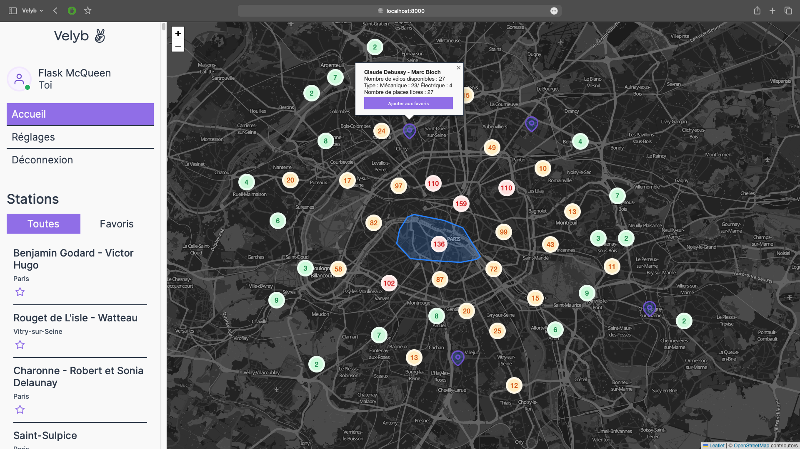

# Velyb

## Introduction

Le projet Velyb est une application web développée en Python à l'aide du framework Flask et du moteur de template Jinja. Son objectif est de fournir une interface conviviale pour visualiser les stations Vélib disponibles dans la ville de Paris.

<!-- Update l'image quand on aura tout fini -->


## Fonctionnalités

- Consultation des stations Vélib sur une carte interactive.
- Visualisation des détails de chaque station (nombre de vélos disponibles, types de vélos disponibles, et nombre de places libres).
- Gestions de stations favorites.
- Création d'un compte utilisateur.
- Modification des informations personnelles de l'utilisateur.

## Installation

```bash
git clone https://github.com/AlessGarau/velyb
```

**Lancer avec Docker**

```bash
docker compose up
```

**Lancer sans Docker**

```bash
# Importer la base de donnée, via votre site admin ou le CLI
mysql -u root -p velyb < script.sql

# Mettre en place les .env dans toutes les apps en suivant les instructions des .env.example

# Prépation des dossiers et lancement des processus
source ./setup.sh all
```

Enfin, accédez à l'interface à l'adresse `http://localhost:8000`

## Tech

### Technologies

- Python
- Framework Flask
- Template Engine Jinja
- JavaScript
- Leaflet & OpenStreetMap

### Architecture

Le projet est composé de plusieurs microservices pour assuré la modularité de chaque partie et une facilité à collaborer.

#### Serveur de templating

Il s'agit de la pierre angular du projet, où tous les services se rassemblent pour créer notre interface.

#### Serveur de cache, avec protocol de communication TCP

Pour contourner la contrainte de création d'un protocol TCP pour servir les données du cache, nous avons crée un protocol mimant des requêtes HTTP. Grâce à cette stratégie, nous n'avons pas eu besoin de supplémentaire pour adapter nos autres services pour communiquer avec le serveur de cache.

Grâce au **Design Pattern Facade**, notre code permettrait de créer facilement des instances de serveur de cache.

```python
""" 
Voici la classe permettant de CACHE les données OpenData, 
héritant de notre classe CacheProtocol et de sa méthode abstrait set_cache()
"""

class OpenDataCache(CacheProtocol):
    VELIB_COUNT = 0

    def __init__(self, ADDRESS_HOST, PORT_DEFAULT, endpoint_to_cache: str, delay: int) -> None:
        super().__init__(ADDRESS_HOST, PORT_DEFAULT, endpoint_to_cache, delay)

    def set_cache(self) -> None:
        res = requests.get(self.API_URL).json()
        self.VELIB_COUNT = res.get('total_count')
        offset = self.VELIB_COUNT

        while (offset >= 100):
            next_res = requests.get(self.API_URL + f"&offset={self.VELIB_COUNT - offset if offset > 200 else offset}").json()
            res["results"].extend(next_res["results"])
            offset -= 100

        self.CACHE = json.dumps(res)
```

#### Microservices

- `microservices_authentification` s'occupe des stories liés à l'authentification, consommable à `http://localhost:8001/api/authentification`
- `microservices_favorite` s'occupe des stories liés aux stations favorites, consommable à `http://localhost:8002/api/favorites`
- `microservices_user` s'occupe des stories liés à l'user, consommable à `http://localhost:8003/api/users`

## Ressources:

- [API de la ville de Paris OpenData](https://opendata.paris.fr/explore/dataset/velib-disponibilite-en-temps-reel/map/?disjunctive.name&disjunctive.is_installed&disjunctive.is_renting&disjunctive.is_returning&disjunctive.nom_arrondissement_communes&dataChart=eyJxdWVyaWVzIjpbeyJjaGFydHMiOlt7InR5cGUiOiJ0cmVlbWFwIiwiZnVuYyI6IlNVTSIsInlBeGlzIjoiY2FwYWNpdHkiLCJzY2llbnRpZmljRGlzcGxheSI6dHJ1ZSwiY29sb3IiOiJyYW5nZS1EYXJrMiJ9XSwieEF4aXMiOiJuYW1lIiwibWF4cG9pbnRzIjo1MCwidGltZXNjYWxlIjoiIiwic29ydCI6IiIsInNlcmllc0JyZWFrZG93biI6IiIsInNlcmllc0JyZWFrZG93blRpbWVzY2FsZSI6IiIsImNvbmZpZyI6eyJkYXRhc2V0IjoidmVsaWItZGlzcG9uaWJpbGl0ZS1lbi10ZW1wcy1yZWVsIiwib3B0aW9ucyI6eyJkaXNqdW5jdGl2ZS5uYW1lIjp0cnVlLCJkaXNqdW5jdGl2ZS5pc19pbnN0YWxsZWQiOnRydWUsImRpc2p1bmN0aXZlLmlzX3JlbnRpbmciOnRydWUsImRpc2p1bmN0aXZlLmlzX3JldHVybmluZyI6dHJ1ZSwiZGlzanVuY3RpdmUubm9tX2Fycm9uZGlzc2VtZW50X2NvbW11bmVzIjp0cnVlfX19XSwiZGlzcGxheUxlZ2VuZCI6dHJ1ZSwiYWxpZ25Nb250aCI6dHJ1ZSwidGltZXNjYWxlIjoiIn0%3D&basemap=stamen.watercolor&location=13,48.8315,2.34867)
- [Documentation Leaflet](https://leafletjs.com/reference.html)
- [Documentation Flask](https://flask.palletsprojects.com/en/3.0.x/)

## Auteurs

- [@LTOssian](https://github.com/LTOssian)
- [@heitzjulien](https://github.com/heitzjulien)
- [@Kobrae-San](https://github.com/Kobrae-San)
- [@AlessGarau](https://github.com/AlessGarau)
- [@Nyoote](https://github.com/Nyoote)
- [@LeBenjos](https://github.com/LeBenjos)
